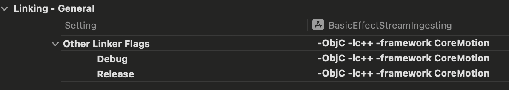

# BlendVision Stream Ingest iOS Samples

Stream From Your App
To set up a streaming source and transmit it to BlendVision's live streaming service via a RTMP link from your own applications.

## Examples
Examples project are available for iOS with UIKit
- [x] Camera and microphone publish.

## Requirements
To run this example, a valid license configuration needs to be set. Please inform our contact window for assistance.

### Development
|Version|Xcode|Swift|
|:----:|:----:|:----:|
|1.7.0+|15.0+|5.9+|
|1.6.0+|15.0+|5.8+|
|1.5.0+|14.0+|5.7+|

Please contains Info.plist.
**iOS 14.0+**
* NSMicrophoneUsageDescription
* NSCameraUsageDescription

## Installation
### Using Swift Package Manager
[Swift Package Manager](https://www.swift.org/documentation/package-manager/) is a tool for managing the distribution of Swift frameworks. It integrates with the Swift build system to automate the process of downloading, compiling, and linking dependencies.

#### Using Xcode
To integrate using Xcode 14, open your Project file and specify it in `Project > Package Dependencies` using the following URL:
```swift
https://github.com/BlendVision/iOS-StreamIngest-SDK.git
```

- Add the linker flags -ObjC -lc++ -framework CoreMotion


- Project info setting
The PerfectLib frameworks requires two permissions: Camera and Microphone. iOS requires the description of the permission usage in APP’s info.plist.

## Prerequisites
Make sure you setup and activate your AVAudioSession iOS.
```swift
import AVFoundation
let session = AVAudioSession.sharedInstance()
do {
    try session.setCategory(.playAndRecord, mode: .default, options: [.defaultToSpeaker, .allowBluetooth])
    try session.setActive(true)
} catch {
    print(error)
}
```

## RTMP Usage
### Ingest
```swift
// Create an StreamIngest instance with your desired configurations
let config = StreamIngestConfig(key: "licenseKey")
let stream = try await StreamIngest.create(with: config)

// Create a StreamRenderView and add it into your subview
previewView = StreamRenderView()
previewView.translatesAutoresizingMaskIntoConstraints = false
view.addSubview(previewView)

// Attach audio device
stream.attachAudio(AVCaptureDevice.default(for: .audio)) { error in
    debugPrint("attaching audio with error=\(String(describing: error))")
}

// Ingesting your stream
stream.startPublish(rtmpUrl: "Your RTMP URL", stream: "Your stream name")
```

## Settings
### Capture
```swift
/// Specifies the video capture settings.
let camera = AVCaptureDevice.default(.builtInWideAngleCamera, for: .video, position: currentPosition)
stream.attachCamera(camera, channel: 0) { error in
    debugPrint("attaching camera with error=\(String(describing: error))")
}
```
### Stream Ingest Quality Settings
Predefined settings configurations used to configure the quality of video streaming ingestion. 
These configurations are:

- StreamIngestQualityLow(): This setting configures the ingestion quality to be low, which may reduce the resolution or frame rate of the video to conserve bandwidth and network traffic.

- StreamIngestQualityMedium(): This setting provides a balanced option suitable for most scenarios, maintaining good video quality while not excessively consuming bandwidth.

- StreamIngestQualityHigh(): This setting is ideal for scenarios requiring high definition and high frame rates, offering superior video quality but potentially consuming more bandwidth and network resources.

- StreamIngestQualityAuto(): Automatically selects Medium or Low quality based on network type.


### Audio Settings
```swift
let quality = StreamIngestQualityMedium()
stream.audioBitrate = await quality.audioBitRate()
```
### Video Settings
```swift
let quality = StreamIngestQualityMedium()
stream.videoSize = await quality.videoSize()
stream.videoBitrate = await quality.videoBitRate()
```

---

## FAQ

### Why is the FPS low (e.g., 15 FPS) when streaming on iOS?

This issue occurs on **iOS 18.3.x** (e.g., 18.3.1, 18.3.3) **only when the Perfect Beauty Module is enabled**.  
It was not reproducible during initial testing on iOS 18.0, and has been resolved in **iOS 18.4 and above**.  
If you encounter low FPS, please upgrade to **iOS 18.4 or later**.

---
